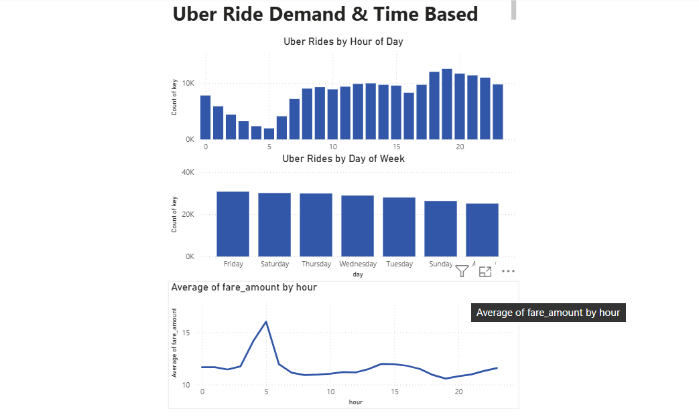

# uber-data-analysis
# Uber Ride Data Analysis

## Project Overview
- Analyzed Uber ride dataset using Python (Pandas, NumPy)
- Performed data cleaning and feature engineering
- Identified peak hours, busiest days, and fare trends

## Tools Used
- Python (Pandas, NumPy, Matplotlib, Seaborn)
- Power BI

## Key Insights
- Peak ride demand occurs during evening hours
- Weekends show higher ride activity
- Most rides are taken by 1–2 passengers
- Fare varies based on time of day

## Dashboard

